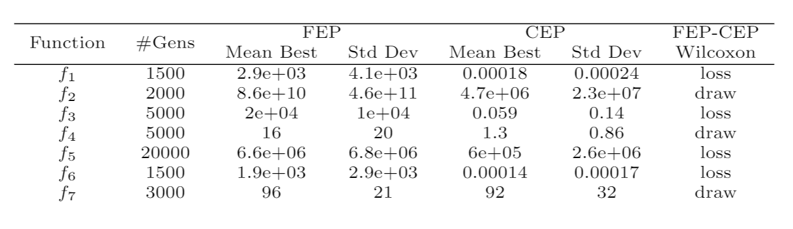

# fastEP

This project is a reproduced work of the paper [Evolutionary Programming Made Faster](https://ieeexplore.ieee.org/document/771163/). 

This paper should be cited if code from this project is used in any way:

```
@article{yao1999evolutionary,
  title={Evolutionary programming made faster},
  author={Yao, Xin and Liu, Yong and Lin, Guangming},
  journal={IEEE Transactions on Evolutionary computation},
  volume={3},
  number={2},
  pages={82--102},
  year={1999},
  publisher={IEEE}
}
```

This project is used for teaching the course **CS408/CSE5012: Evolutionary Computation and Its Applications** at the Southern University of Science and Technology (SUSTech), Shenzhen, China.

*Not 100% sure that it is bug-free. Use at your own risk!*

## Some Details

- Classic Evolutionary Programming (CEP) uses a Gaussian and Fast Evolutionary Programming (FEP) uses a Cauchy distribution for mutation.
- Set values to bounds for points which are out of bounds.
- A fixed lower bound is set for step-size.
- The individual is mutated first then mutate the step-size.

The programs will also output formatted Latex table for results and plots of evolutionary curves.


## Lab 4: Explore how search operators and implementation details affect an EA’s performance.

### Task
- We have seen how the performance of an EA changes when using a Cauchy, instead of Gaussian, to sample random perturbation to generate offspring.
- There are many details which affect an EA's performance:
  - Distributions used to sample random perturbation to generate offspring (cf. pages 8-10, 37 of the slides for Lecture 4)
  - Techniques for handle points out of bounds
  - Set a fix / an adaptive lower bound for $\eta$ or not (cf. pages 39-40 of the slides for Lecture 4)
  - Mutate $\x$ first or mutate $\eta$ first  (cf. Eqs. (2) and (3) on page 9 of the slides for Lecture 4)
  - Mix search biases by self-adaptation (cf. pages 34-36 of the slides for Lecture 4)
  
  (More details can be found in the slides for Lecture 4!)

In this lab, we will exxplore how **search operators** and **implementation details** affect an EA's performance.

### Results and Discussion (to be filled by students)
**Attention: Repeat fewer times or use a smaller number of generations as the experiments will run long ...**

1. Use Levy Distribution to sample random perturbation to generate offspring (蒋如意)

TODO

2. When a point is outside of bounds, re-sample it till being inside (谭浩)
  
running times = 50

population size = 100

max resample = 5



3. When a point is outside of bounds, use a projection to map $(-\infty,\infty)$ to $[lb,ub]$ (裴季源)
  
TODO
  
4. Use mutation step-size to adjust lower bounds for $\eta$ (欧阳奕成)

TODO

5. Mutate $\eta$ first then mutate $\x$ (赵志翔)

TODO

6. Generate 2 offspring using Cauchy and Gaussian, take the fitter one (IFEP) (张清泉)
 
 **Attention: You will use more evaluations if fixing the same number of generations!**

  TODO
  
7. Use mean mutation operator (吴钰)

experiment times = 10

population size = 50

initilize all eta = 0.1

 

Fixed some bugs :

  
8. Use adaptive mutation operator (潘超)
  

  | Function | Gens  |       Mean Best       |           Std           | Repeat Times |
| :------: | :---: | :-------------------: | :---------------------: | :----------: |
|    f1​    | 1500  | 0.0001349350644718995 | 0.000048169088531777096 |      3       |
|    f2    | 2000  | 0.020016292787322087  |  0.004716485331152362   |      3       |
|    f3    | 5000  | 0.004331321194961257  |  0.004580825012831331   |      3       |
|    f4    | 5000  | 0.002028869443357706  |  0.0004553129610780441  |      3       |
|    f5    | 20000 |   16.368578034811772    |    18.20468935826449    |      6       |
|    f6    | 1500  |   0.00017467749137696137   |     0.00005686683961554744e    |      3       |
|    f7    | 3000  | 0.020599394508814404  |  0.007440640369010158   |      3       |
|    f8    | 9000  |  -11147.713664419933  |    83.0385284471996     |      3       |
|    f9    | 5000  |  0.6657936107397268   |   0.46959053448764076   |      3       |
